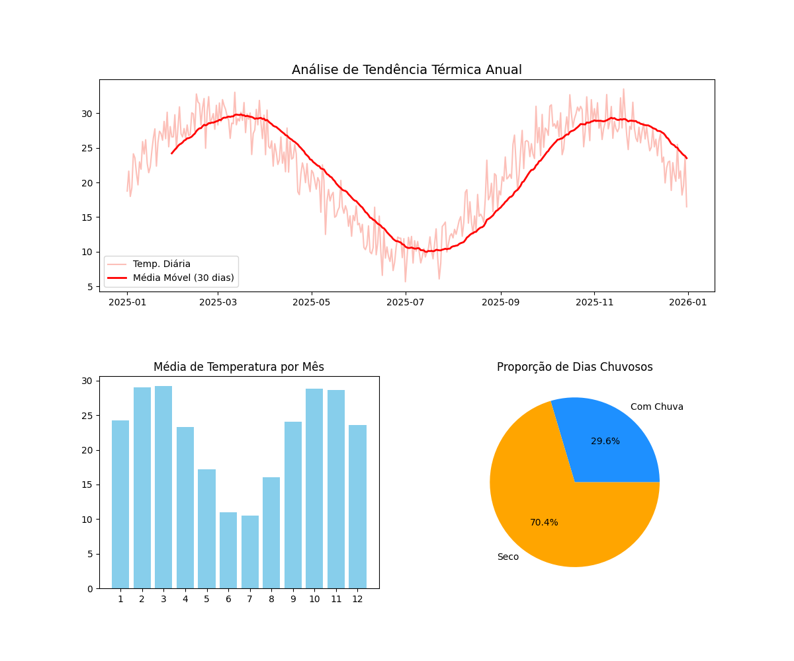

# 🌦️ Dashboard de Monitoramento Climático Anual

Este projeto utiliza **Python** e as bibliotecas **Pandas** e **Matplotlib** para realizar a análise de dados climáticos simulados de um ciclo completo de 365 dias.

## 🚀 Objetivo do Projeto
Demonstrar a aplicação de médias móveis para identificação de tendências sazonais e visualização de grandes volumes de dados em ambiente Linux.

## 📊 Visualização dos Resultados
Abaixo, o gráfico gerado automaticamente pelo script, mostrando a correlação entre temperatura e precipitação ao longo de um ano:

## 🛠️ Tecnologias Utilizadas
* **Linguagem:** Python 3.x
* **Bibliotecas:** Pandas, Matplotlib, Numpy
* **Sistema Operacional:** Lubuntu Linux (Otimizado com SSD e Swap)
* **Controle de Versão:** Git/GitHub

---
*Desenvolvido por Roberlande Silva*
